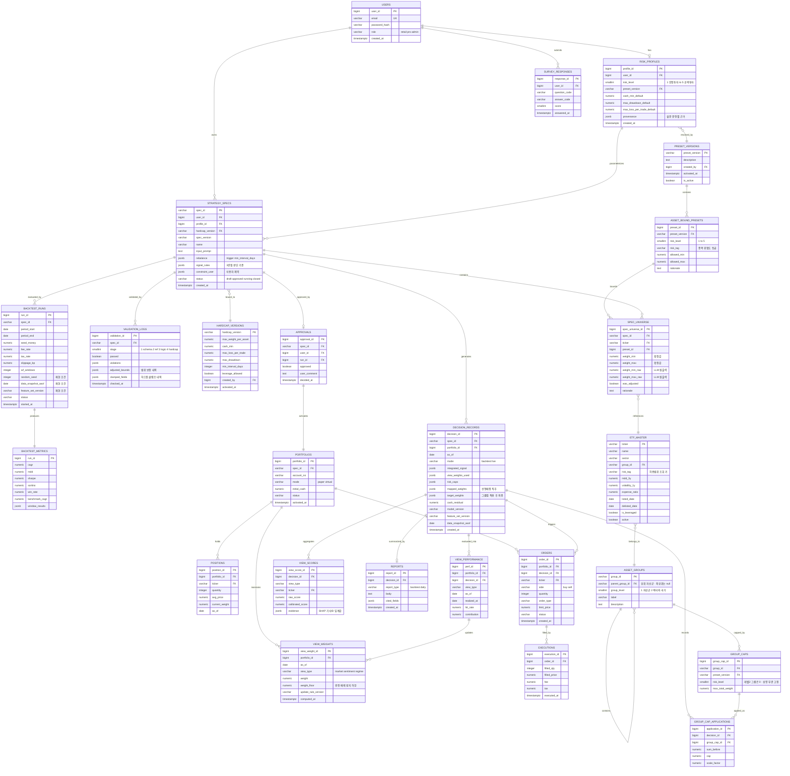
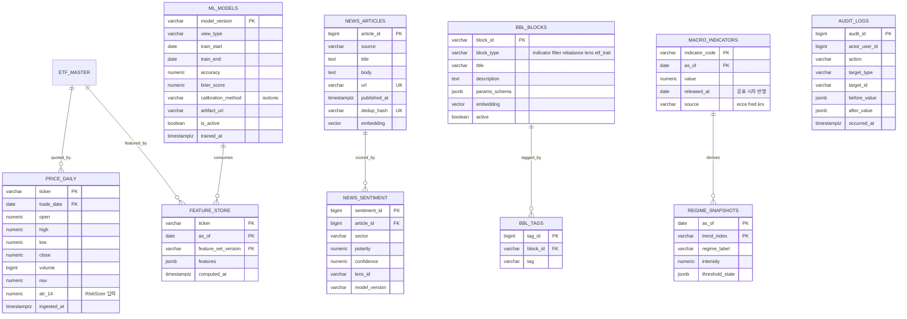

# DB 설계 (상세설계서 4장 발췌)

> 출처: 2026-09-06 회의록 하위 「상세설계서 — 시스템 상세 구성도 · 기능명세 · UI설계 · DB설계」 4장.
> `docs/infra-spec.md` 3단계가 "컬럼 정의는 상세설계서 4.1~4.2 ER 다이어그램을 그대로 따른다"고
> 지시하는 대상이 이 문서다. 여기 적힌 컬럼이 정본이며, 없는 컬럼을 임의로 추가하지 않는다.

# 4. DB 설계
## 4.1 ER 다이어그램 · 전략 및 운용 도메인

## 4.2 ER 다이어그램 · 데이터 및 지식 도메인

## 4.3 설계 원칙
<table fit-page-width="true" header-row="true">
<tr>
<td>원칙</td>
<td>적용 대상</td>
<td>이유</td>
</tr>
<tr>
<td>**Spec 3분할**</td>
<td>STRATEGY_SPECS는 판단기준과 운용대상만, VIEW_WEIGHTS는 채점기준, DECISION_RECORDS는 가변값</td>
<td>기획서 아이디어 2의 직접 구현. Spec 테이블에는 가변 컬럼도 가중치 컬럼도 두지 않는다</td>
</tr>
<tr>
<td>**재현 조건 위치**</td>
<td>random_seed · data_snapshot_asof · feature_set_version은 BACKTEST_RUNS와 DECISION_RECORDS에만 존재</td>
<td>9/4 확정본에서 reproducibility 블록이 제거되었으므로 Spec이 아닌 실행 단위로 기록한다</td>
</tr>
<tr>
<td>**2단 범위 추적**</td>
<td>SPEC_UNIVERSE가 preset_id를 FK로 들고, 보정 전 원본값을 weight_min_raw · weight_max_raw에 보존</td>
<td>어떤 허용범위 안에서 어떤 값이 나왔고 코드가 무엇을 보정했는지를 사후에 완전히 복원할 수 있다</td>
</tr>
<tr>
<td>**프리셋 및 하드캡 버전 고정**</td>
<td>STRATEGY_SPECS가 hardcap_version을, RISK_PROFILES가 preset_version을 참조</td>
<td>운영자가 값을 바꿔도 기존 Spec의 생성 근거가 흔들리지 않는다</td>
</tr>
<tr>
<td>**시점 태그 이중화**</td>
<td>MACRO_INDICATORS의 as_of와 released_at, PRICE_DAILY의 trade_date와 ingested_at</td>
<td>지표가 가리키는 시점과 실제 공표 시점이 다르므로, 공표 전 데이터가 과거 판단에 섞이는 것을 막는다</td>
</tr>
<tr>
<td>**Spec 불변**</td>
<td>STRATEGY_SPECS와 SPEC_UNIVERSE는 승인 후 UPDATE 금지</td>
<td>수정이 필요하면 새 spec_version을 발행한다. 사후 감사의 기준점을 보존하기 위함</td>
</tr>
<tr>
<td>**가중치 이력 보존**</td>
<td>VIEW_WEIGHTS는 as_of 단위로 행을 추가하고 갱신하지 않는다</td>
<td>백테스트가 과거 시점의 가중치를 그대로 재현할 수 있어야 하므로 덮어쓰기를 금지한다</td>
</tr>
<tr>
<td>**그룹 캡 적용 기록**</td>
<td>GROUP_CAP_APPLICATIONS에 sum_before · cap · scale_factor 저장</td>
<td>사용자 설명문의 "묶음 상한에 걸려 축소했다"는 문장을 근거 있는 수치로 뒷받침한다</td>
</tr>
<tr>
<td>**하이퍼테이블**</td>
<td>PRICE_DAILY, FEATURE_STORE, MACRO_INDICATORS</td>
<td>시간 파티셔닝과 압축으로 백테스트 구간 스캔 성능을 확보한다</td>
</tr>
<tr>
<td>**벡터 컬럼 동거**</td>
<td>BBL_BLOCKS.embedding, NEWS_ARTICLES.embedding</td>
<td>같은 테이블의 태그 및 시점 조건과 함께 필터링하기 위해 별도 벡터 저장소를 두지 않는다</td>
</tr>
<tr>
<td>**복합 기본키**</td>
<td>PRICE_DAILY, FEATURE_STORE, MACRO_INDICATORS, REGIME_SNAPSHOTS</td>
<td>시간 축을 포함한 자연키를 사용해 중복 적재를 구조적으로 차단한다</td>
</tr>
</table>
## 4.4 주요 인덱스
```sql
-- 시점 경계 조회가 모든 판단의 진입점이므로 이 세 개가 가장 중요하다
CREATE INDEX idx_feature_ticker_asof   ON feature_store    (ticker, as_of DESC);
CREATE INDEX idx_price_ticker_date     ON price_daily      (ticker, trade_date DESC);
CREATE INDEX idx_macro_code_asof       ON macro_indicators (indicator_code, as_of DESC, released_at DESC);

-- 2단 허용범위 조회 (성향등급 x 위험도등급)
CREATE UNIQUE INDEX uq_preset_lookup   ON asset_bound_presets (preset_version, risk_level, risk_tag);

-- 관점 가중치는 as_of 기준 최신 행을 읽는다
CREATE UNIQUE INDEX uq_view_weight     ON view_weights (portfolio_id, as_of, view_type);

-- 결정 기록 조회 및 감사 추적
CREATE INDEX idx_decision_spec_asof    ON decision_records (spec_id, as_of DESC);
CREATE INDEX idx_viewscore_decision    ON view_scores      (decision_id, view_type);
CREATE INDEX idx_groupcap_decision     ON group_cap_applications (decision_id);

-- 뉴스 감성 lookback 조회
CREATE INDEX idx_news_published        ON news_articles (published_at DESC);
CREATE UNIQUE INDEX uq_news_dedup      ON news_articles (dedup_hash);

-- 벡터 유사도 검색
CREATE INDEX idx_bbl_embedding  ON bbl_blocks    USING hnsw (embedding vector_cosine_ops);
CREATE INDEX idx_news_embedding ON news_articles USING hnsw (embedding vector_cosine_ops);

-- 하이퍼테이블 전환
SELECT create_hypertable('price_daily',      'trade_date', if_not_exists => TRUE);
SELECT create_hypertable('feature_store',    'as_of',      if_not_exists => TRUE);
SELECT create_hypertable('macro_indicators', 'as_of',      if_not_exists => TRUE);
```
## 4.5 시점 경계 질의 규약
피처와 관점 가중치 조회는 반드시 저장소 계층의 단일 함수를 거치며, 그 함수는 as_of를 필수 인자로 받고 그보다 최신인 레코드를 반환하지 않는다. 응용 코드가 테이블을 직접 조회하는 것을 코드 리뷰에서 금지한다. **이 규약이 깨지면 백테스트 결과 전체가 무의미해진다.**
```python
def get_features(ticker: str, as_of: date, feature_set_version: str) -> dict:
    """as_of 이후의 데이터는 어떤 경우에도 반환하지 않는다."""
    return db.fetch_one(
        """
        SELECT features
          FROM feature_store
         WHERE ticker = %(ticker)s
           AND feature_set_version = %(fsv)s
           AND as_of <= %(as_of)s
         ORDER BY as_of DESC
         LIMIT 1
        """,
        {"ticker": ticker, "fsv": feature_set_version, "as_of": as_of},
    )


def get_macro(indicator_code: str, as_of: date) -> float:
    """거시지표는 공표 시차가 있으므로 released_at 기준으로도 걸러야 한다."""
    return db.fetch_val(
        """
        SELECT value
          FROM macro_indicators
         WHERE indicator_code = %(code)s
           AND as_of       <= %(as_of)s
           AND released_at <= %(as_of)s
         ORDER BY as_of DESC
         LIMIT 1
        """,
        {"code": indicator_code, "as_of": as_of},
    )


def get_view_weights(portfolio_id: int, as_of: date) -> dict:
    """관점 가중치도 시점 자산이다.
    오늘 성과가 오늘 판단에 쓰이면 미래를 미리 보는 것이 되므로
    as_of 이전에 계산된 행만 읽는다."""
    rows = db.fetch_all(
        """
        SELECT DISTINCT ON (view_type) view_type, weight
          FROM view_weights
         WHERE portfolio_id = %(pid)s
           AND as_of < %(as_of)s
         ORDER BY view_type, as_of DESC
        """,
        {"pid": portfolio_id, "as_of": as_of},
    )
    return {r["view_type"]: r["weight"] for r in rows}
```
